# GSO Borrowing System Documentation

## 1. System Analysis

### 1.1 Overview

The General Services Office Borrowing System is a PHP and MySQL web application used to manage the borrowing, approval, release, return, maintenance, and reporting of university facilities, equipment, and related resources. The system supports two primary user roles:

- `Admin`: manages accounts, inventory, approvals, releases, return reviews, maintenance schedules, reports, notifications, and activity logs.
- `Borrower`: browses resources, submits requests, tracks borrowing status, and submits return proof.

The application currently runs on:

- `PHP 8.2.12`
- `MariaDB 10.4.32`
- `PDO` for database access
- `PHPMailer` for account verification and password reset mail delivery

### 1.2 Functional Scope

The inspected codebase supports the following major functions:

1. User registration, email verification, login, logout, and password reset.
2. Admin review of borrower accounts and account status control.
3. Resource inventory management for items and facilities.
4. Borrower request submission with schedule and availability validation.
5. Admin approval, rejection, and release of borrowing requests.
6. Borrower return submission with photos and condition reporting.
7. Admin return inspection and inventory condition updates.
8. Maintenance scheduling that blocks borrowing during maintenance windows.
9. Notifications and activity logging for important system actions.
10. Reporting and dashboard summaries for administrative monitoring.

### 1.3 Key Processes

#### Login Process

- The user enters an email address or username and password.
- The system checks whether the account exists.
- If no account is found, the system returns `Invalid username or password`.
- If the account exists but the password is incorrect, the system returns `Incorrect password`.
- The system validates email verification, account status, and role-based access before creating a session.
- Successful login redirects the user to the borrower or admin area.

#### Borrowing Process

- The borrower selects a resource and submits the request schedule and details.
- The system validates resource status, stock or facility schedule availability, duplicate requests, and maintenance conflicts.
- A valid request is stored as `Pending`.
- Admin reviews the request and may approve, reject, or release it.
- On release, stock is updated for item resources and the due date is generated.

#### Return Process

- The borrower submits return notes, a reported condition, and up to three proof photos.
- The system stores the return submission as `Pending`.
- Admin reviews the submitted proof and records the inspection result.
- If approved, the request status becomes `Returned` and the resource inventory or condition is updated.
- If rejected, the borrower is asked to resubmit return proof.

## 2. Data Flow Diagram (DFD)

### 2.1 Context Diagram (Level 0)

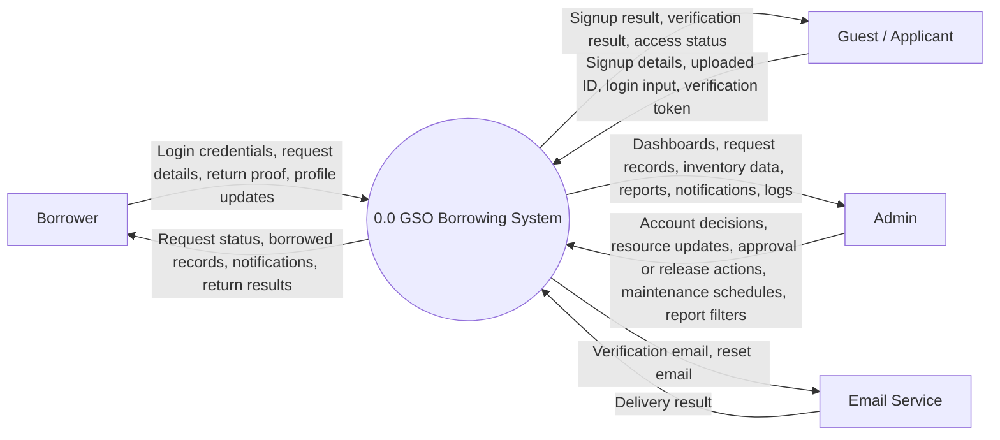

### 2.2 Level 1 DFD

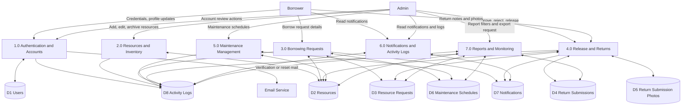

## 3. Flowcharts

### 3.1 Login Process Flowchart

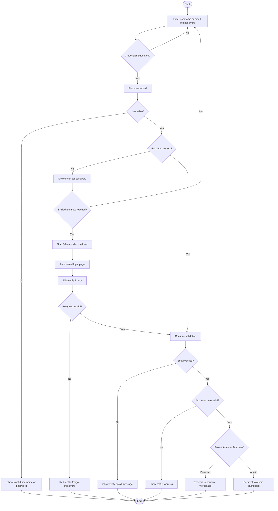

### 3.2 Borrowing Process Flowchart

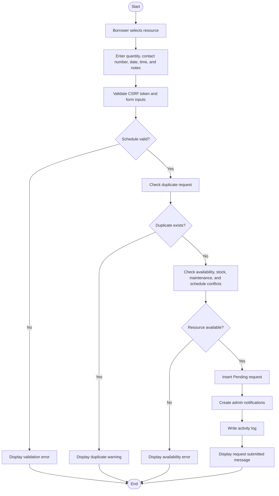

### 3.3 Return Process Flowchart

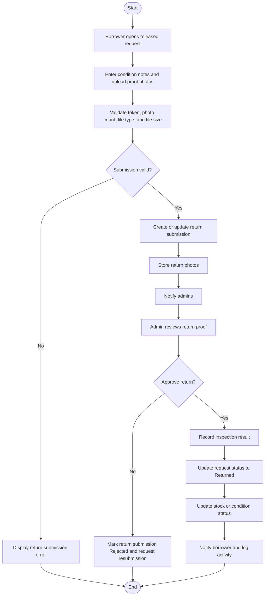

## 4. Entity Relationship Diagram (ERD)

Note: The following ERD reflects the application’s logical relationships used in code. In the inspected schema, `return_submissions.request_id -> resource_requests.request_id` is the only enforced database foreign key; the remaining relationships are application-managed logical links.

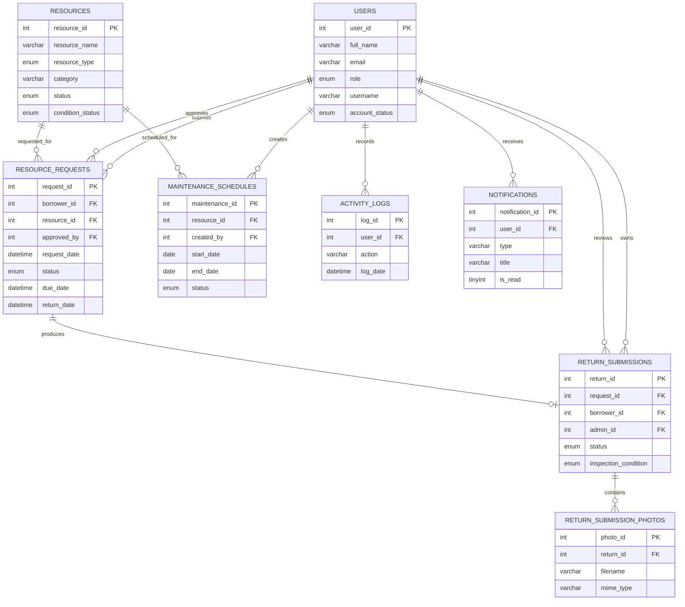

## 5. UML Diagrams

### 5.1 Use Case Diagram

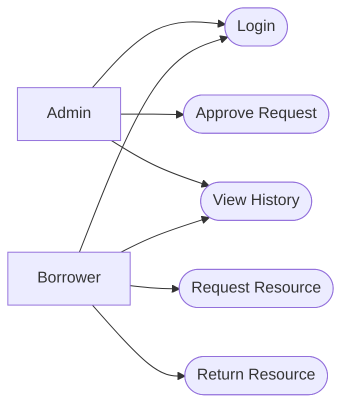

### 5.2 Activity Diagram: Login

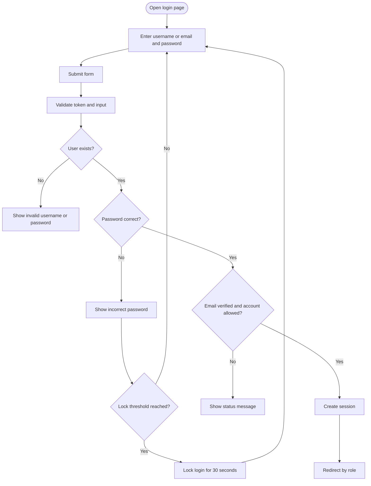

### 5.3 Activity Diagram: Borrowing Workflow

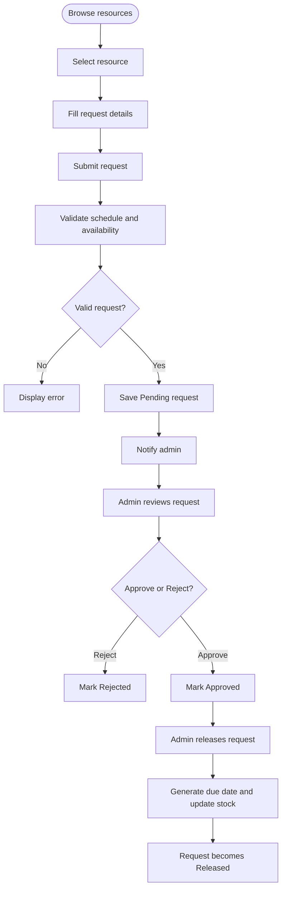

### 5.4 Activity Diagram: Return Workflow

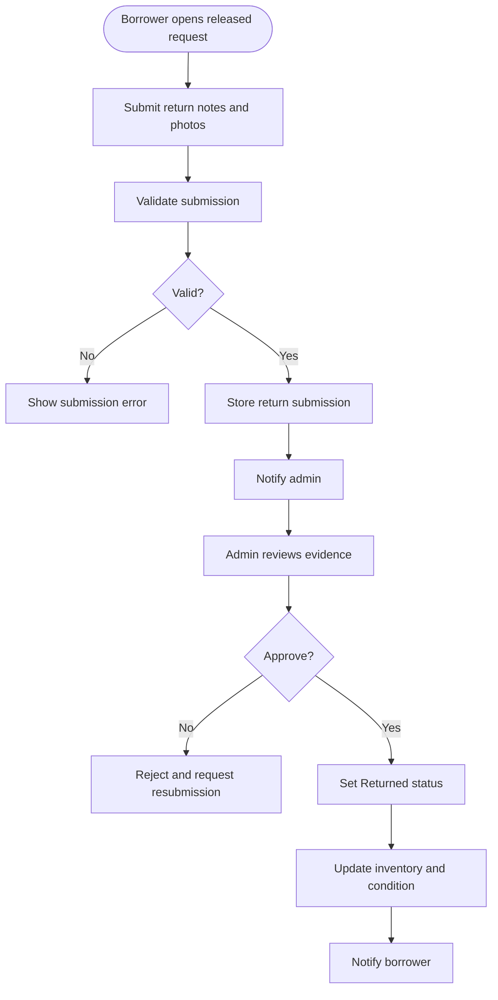

### 5.5 Sequence Diagram: Login Process

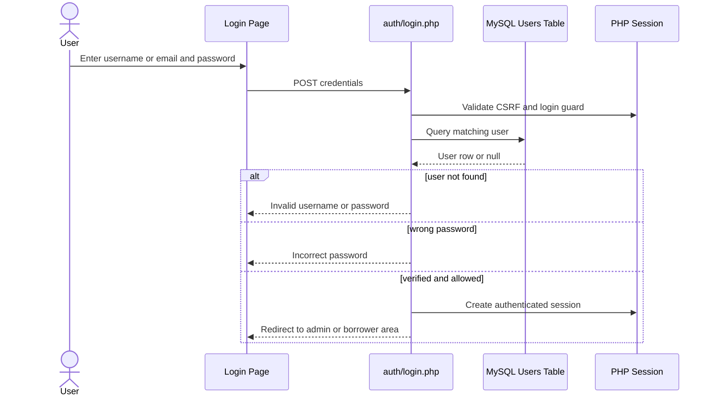

### 5.6 Sequence Diagram: Borrow Request Process

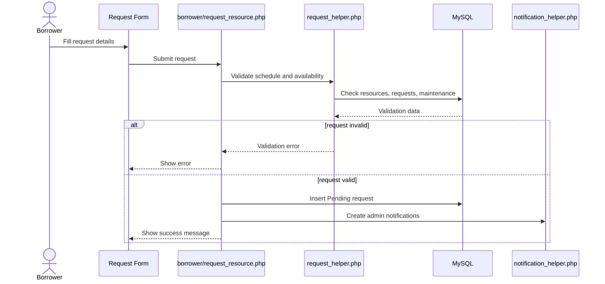

### 5.7 Class Diagram

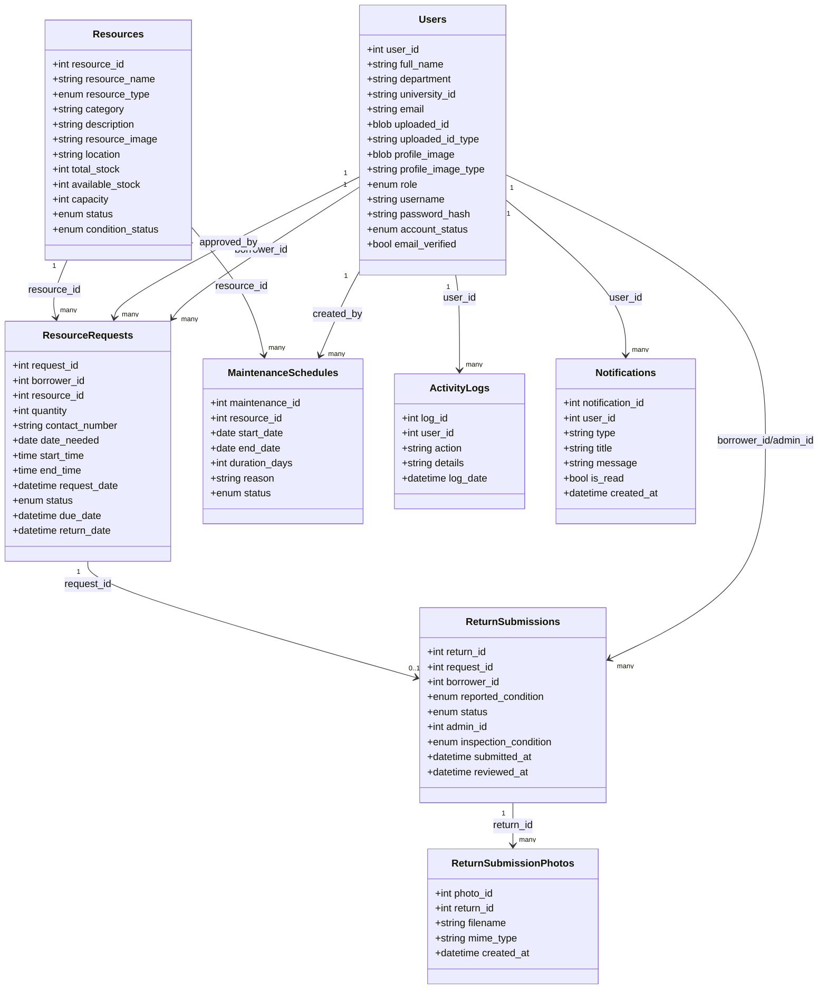

## 6. Data Dictionary

### 6.1 `users`

| Field Name | Data Type | Description | Constraints |
| --- | --- | --- | --- |
| `user_id` | `int(11)` | Unique account identifier. | `PK`, `AUTO_INCREMENT`, `NOT NULL` |
| `full_name` | `varchar(100)` | User’s complete name. | `NOT NULL` |
| `department` | `varchar(100)` | Department or college affiliation. | `NULL` |
| `university_id` | `varchar(30)` | Institutional ID number. | `UNIQUE`, `NULL` |
| `email` | `varchar(100)` | Primary email used for login and notifications. | `UNIQUE`, `NOT NULL` |
| `uploaded_id` | `longblob` | Stored uploaded ID document used during registration. | `NULL` |
| `uploaded_id_type` | `varchar(100)` | MIME type of the uploaded ID file. | `NULL` |
| `profile_image` | `longblob` | Stored profile image for the user account. | `NULL` |
| `profile_image_type` | `varchar(100)` | MIME type of the stored profile image. | `NULL` |
| `role` | `enum('Admin','Borrower')` | Role that determines system access and redirection. | `NOT NULL`, default `Borrower` |
| `username` | `varchar(50)` | Username alternative for login. | `UNIQUE`, `NOT NULL` |
| `password_hash` | `varchar(255)` | Hashed account password. | `NOT NULL` |
| `reset_token_hash` | `varchar(255)` | Hashed password reset token. | `NULL` |
| `reset_token_expires_at` | `datetime` | Expiration date and time of the reset token. | `NULL` |
| `account_status` | `enum('Pending','Approved','Rejected','Disabled')` | Administrative account status. | `NOT NULL`, default `Pending` |
| `approved_by` | `int(11)` | Admin who approved or changed the account status. | `FK (logical) -> users.user_id`, `NULL` |
| `approved_at` | `datetime` | Date and time the account was approved. | `NULL` |
| `created_at` | `datetime` | Account creation timestamp. | `NOT NULL`, default `CURRENT_TIMESTAMP` |
| `password_updated_at` | `datetime` | Last password update timestamp. | `NULL` |
| `email_verified` | `tinyint(1)` | Indicates whether the email has been verified. | default `0`, `NULL allowed in schema` |
| `verification_token` | `varchar(255)` | Email verification token. | `NULL` |

### 6.2 `resources`

| Field Name | Data Type | Description | Constraints |
| --- | --- | --- | --- |
| `resource_id` | `int(11)` | Unique identifier of the resource. | `PK`, `AUTO_INCREMENT`, `NOT NULL` |
| `resource_name` | `varchar(100)` | Name of the resource or facility. | `NOT NULL` |
| `resource_type` | `enum('Item','Facility')` | Distinguishes item borrowing from facility reservation. | `NOT NULL` |
| `category` | `varchar(50)` | Resource classification or grouping. | `NULL` |
| `description` | `varchar(255)` | Short description of the resource. | `NULL` |
| `resource_image` | `varchar(255)` | Stored filename of the resource image. | `NULL` |
| `location` | `varchar(100)` | Physical location of the resource. | `NULL` |
| `total_stock` | `int(11)` | Total stock count for item resources. | `NULL` |
| `available_stock` | `int(11)` | Currently available stock count. | `NULL` |
| `capacity` | `int(11)` | Capacity for facility resources. | `NULL` |
| `status` | `enum('Available','Unavailable','Maintenance')` | Operational availability of the resource. | `NOT NULL`, default `Available` |
| `condition_status` | `enum('Good','Damaged','Missing Parts','Needs Repair','Lost')` | Current physical condition status. | `NOT NULL`, default `Good` |
| `condition_notes` | `varchar(500)` | Notes about condition, inspection, or damage. | `NULL` |
| `is_archived` | `tinyint(1)` | Indicates whether the resource is archived. | `NOT NULL`, default `0` |
| `created_at` | `datetime` | Resource creation timestamp. | `NOT NULL`, default `CURRENT_TIMESTAMP` |

### 6.3 `resource_requests`

| Field Name | Data Type | Description | Constraints |
| --- | --- | --- | --- |
| `request_id` | `int(11)` | Unique identifier of the borrowing request. | `PK`, `AUTO_INCREMENT`, `NOT NULL` |
| `borrower_id` | `int(11)` | Borrower who submitted the request. | `NOT NULL`, `FK (logical) -> users.user_id` |
| `resource_id` | `int(11)` | Resource being requested. | `NOT NULL`, `FK (logical) -> resources.resource_id` |
| `quantity` | `int(11)` | Requested quantity for item borrowing. | `NULL` |
| `contact_number` | `varchar(30)` | Contact number used for urgent coordination or reminders. | `NULL` |
| `date_needed` | `date` | Requested borrowing or reservation date. | `NULL` |
| `start_time` | `time` | Requested start time. | `NULL` |
| `end_time` | `time` | Requested end time. | `NULL` |
| `request_date` | `datetime` | Date and time when the request was created. | `NOT NULL`, default `CURRENT_TIMESTAMP` |
| `status` | `enum('Pending','Under Review','Approved','Rejected','Cancelled','Released','Returned')` | Request lifecycle status. | `NOT NULL`, default `Pending` |
| `approved_by` | `int(11)` | Admin who approved or released the request. | `NULL`, `FK (logical) -> users.user_id` |
| `reviewed_by` | `int(11)` | Reviewer reference reserved for additional review tracking. | `NULL`, `FK (logical) -> users.user_id` |
| `approved_at` | `datetime` | Approval or release timestamp. | `NULL` |
| `reviewed_at` | `datetime` | Review timestamp. | `NULL` |
| `due_date` | `datetime` | Computed due date after release. | `NULL` |
| `return_date` | `datetime` | Final recorded return date. | `NULL` |
| `notes` | `varchar(255)` | Borrower’s request notes. | `NULL` |
| `last_reminded_at` | `datetime` | Timestamp of the last overdue reminder. | `NULL` |
| `reminder_count` | `int(11)` | Number of reminders sent for this request. | `NOT NULL`, default `0` |

### 6.4 `return_submissions`

| Field Name | Data Type | Description | Constraints |
| --- | --- | --- | --- |
| `return_id` | `int(11)` | Unique identifier of the return submission. | `PK`, `AUTO_INCREMENT`, `NOT NULL` |
| `request_id` | `int(11)` | Borrowing request linked to the return submission. | `UNIQUE`, `NOT NULL`, `FK -> resource_requests.request_id` |
| `borrower_id` | `int(11)` | Borrower who submitted the return proof. | `NOT NULL`, `FK (logical) -> users.user_id` |
| `condition_notes` | `varchar(500)` | Borrower notes regarding returned condition. | `NULL` |
| `reported_condition` | `enum('Good','Damaged','Missing Parts','Needs Repair','Lost')` | Borrower-declared return condition. | `NULL` |
| `status` | `enum('Pending','Approved','Rejected')` | Return review status. | `NOT NULL`, default `Pending` |
| `admin_id` | `int(11)` | Admin who reviewed the return submission. | `NULL`, `FK (logical) -> users.user_id` |
| `admin_notes` | `varchar(500)` | Admin response or resubmission note. | `NULL` |
| `inspection_condition` | `enum('Good','Damaged','Missing Parts','Needs Repair','Lost')` | Final admin inspection condition. | `NULL` |
| `inspection_remarks` | `varchar(500)` | Additional admin inspection remarks. | `NULL` |
| `submitted_at` | `datetime` | Submission timestamp. | `NOT NULL`, default `CURRENT_TIMESTAMP` |
| `reviewed_at` | `datetime` | Review timestamp. | `NULL` |

### 6.5 `return_submission_photos`

| Field Name | Data Type | Description | Constraints |
| --- | --- | --- | --- |
| `photo_id` | `int(11)` | Unique identifier of the stored return photo. | `PK`, `AUTO_INCREMENT`, `NOT NULL` |
| `return_id` | `int(11)` | Related return submission. | `NOT NULL`, `FK (logical) -> return_submissions.return_id` |
| `filename` | `varchar(255)` | Stored filename of the uploaded return photo. | `NOT NULL` |
| `mime_type` | `varchar(100)` | MIME type of the uploaded photo. | `NOT NULL` |
| `created_at` | `datetime` | Timestamp when the photo record was created. | `NOT NULL`, default `CURRENT_TIMESTAMP` |

### 6.6 `maintenance_schedules`

| Field Name | Data Type | Description | Constraints |
| --- | --- | --- | --- |
| `maintenance_id` | `int(11)` | Unique identifier of the maintenance schedule. | `PK`, `AUTO_INCREMENT`, `NOT NULL` |
| `resource_id` | `int(11)` | Resource scheduled for maintenance. | `NOT NULL`, `FK (logical) -> resources.resource_id` |
| `start_date` | `date` | Maintenance start date. | `NOT NULL` |
| `end_date` | `date` | Maintenance end date. | `NOT NULL` |
| `duration_days` | `int(11)` | Computed maintenance duration in days. | `NOT NULL`, default `1` |
| `reason` | `varchar(255)` | Reason for maintenance. | `NOT NULL` |
| `remarks` | `varchar(500)` | Additional maintenance details. | `NULL` |
| `status` | `enum('Scheduled','In Progress','Completed','Cancelled')` | Current maintenance state. | `NOT NULL`, default `Scheduled` |
| `created_by` | `int(11)` | Admin who created the maintenance record. | `NOT NULL`, `FK (logical) -> users.user_id` |
| `updated_by` | `int(11)` | Admin who last updated the maintenance record. | `NULL`, `FK (logical) -> users.user_id` |
| `created_at` | `datetime` | Creation timestamp. | `NOT NULL`, default `CURRENT_TIMESTAMP` |
| `updated_at` | `datetime` | Last update timestamp. | `NULL` |

### 6.7 `activity_logs`

| Field Name | Data Type | Description | Constraints |
| --- | --- | --- | --- |
| `log_id` | `int(11)` | Unique identifier of the activity record. | `PK`, `AUTO_INCREMENT`, `NOT NULL` |
| `user_id` | `int(11)` | User associated with the logged activity. | `NULL`, `FK (logical) -> users.user_id` |
| `action` | `varchar(100)` | Short action label. | `NOT NULL` |
| `details` | `varchar(255)` | Additional details describing the activity. | `NULL` |
| `log_date` | `datetime` | Timestamp of the logged event. | `NOT NULL`, default `CURRENT_TIMESTAMP` |

### 6.8 `notifications`

| Field Name | Data Type | Description | Constraints |
| --- | --- | --- | --- |
| `notification_id` | `int(11)` | Unique identifier of the notification. | `PK`, `AUTO_INCREMENT`, `NOT NULL` |
| `user_id` | `int(11)` | Recipient user of the notification. | `NOT NULL`, `FK (logical) -> users.user_id` |
| `type` | `varchar(50)` | Notification category or event type. | `NOT NULL` |
| `title` | `varchar(120)` | Notification title shown in the UI. | `NOT NULL` |
| `message` | `varchar(255)` | Notification body text. | `NOT NULL` |
| `link` | `varchar(255)` | Optional destination link related to the notification. | `NULL` |
| `is_read` | `tinyint(1)` | Indicates whether the user has read the notification. | `NOT NULL`, default `0` |
| `created_at` | `datetime` | Timestamp when the notification was created. | `NOT NULL`, default `CURRENT_TIMESTAMP` |

## 7. Upload and Configuration Findings

The current environment checked during analysis reported:

- `upload_max_filesize = 40M`
- `post_max_size = 40M`
- `memory_limit = 512M`
- `max_allowed_packet = 134217728` bytes (`128 MB`)

Practical interpretation:

1. The server and database configuration are not the primary bottleneck for the reported `>2MB` image issue in this workspace.
2. The more likely bottleneck was application-level validation and BLOB write handling.
3. Profile image uploads were updated to use shared validation and `PDO::PARAM_LOB`, and the application limit was aligned to `5 MB` for profile images.

## 8. Summary

The GSO Borrowing System already contains a complete end-to-end operational workflow for account management, borrowing, release, returns, maintenance, notifications, and reporting. The documentation above translates the inspected implementation into analysis artifacts that can be used for thesis documentation, technical reports, or system presentation materials.
